# Issue Pilot
 
Issue Pilot ist ein Ticket-Management-System. Bei dieser überarbeiteten Version wurde einiges geändert und gefixt. Die Web-Anwendung entstand ursprünglich als Semesterprojekt von Tim Dohle und mir, Niklas Knopp.

 
Bei dieser von Version ist Folgendes von mir überarbeitet worden: 
 

* Views
* Models
* ViewModels außer die für Statistiken
* Controller
* UserRepository, TicketRepository
* Tests
 

Folgendes habe ich nicht überarbeitet und wurde von Tim Dohle geschrieben:
* ViewModels bezüglich Statistiken
* Repositories: StatisticsRepository, ProjectRepository, ProjectRoleRepository, AspNetRoleRepository

 

Die usprüngliche Version befindet sich unter:
 
https://github.com/TiDoFL/Arbeitsprobe-IssuePilot

# Beschreibung der Programmstruktur

Issue Pilot ist eine Asp.NET Core Web App im MVC Pattern.
 
Die Hauptschichten der Anwendung sind:
* Views
* ViewModels
* Controllers
* Repositories
* Datenbank-Models

Weitere Schichten sind folgende:
* Tests (Tests der Repositories mit xUnit)
* Configuration

Folgende Frameworks und Bibliotheken wurden verwendet:
* ASP.NET Core MVC 2.2.5 
* Entity Framework Core v3.1.9
* Bootstrap v4.3.1
* Bootstrap Select v1.13.18
* xUnit v2.4.1
* FullCalendar v5.5.1
* Chart.js v2.9.4
* ASP. Net Identity v3.1.9

# Funktionen & Anleitung
## Login

* Über die **Demo-Buttons** bei der Login-Seite kann man sich als **drei verschiedene Demo-Nutzer** anmelden, die die drei Nutzerrollen zeigen
* Ein Admin-Konto mit den Nutzernamen "Admin" und dem Passwort "password" ist eine weitere Anmeldemöglichkeit, wenn noch kein weiteres Konto erstellt wurde

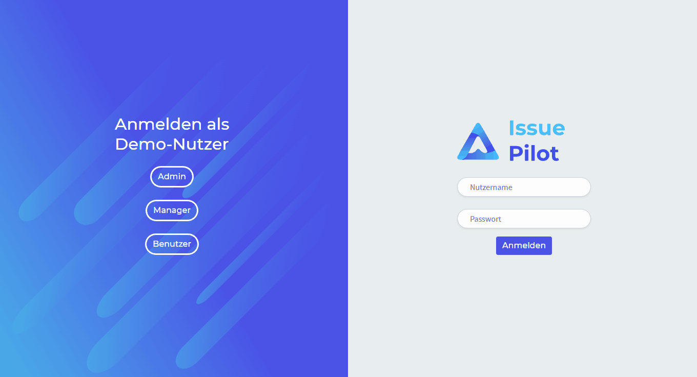

## Dashboard

Durch verschiedene Aktionen werden Benachrichtigungen erzeugt. 
 
Folgende Aktionen erzeugen eine Benachrichtigung:
* Hinzufügen von Nutzer zum Projekt
* Hinzufügen eines Kommentars
* Ändern des Status
* Zufügen von Projektmitglied zu einem Ticket
* Entfernen von Projektmitglied von einem Ticket
* Hinzufügen von Nutzer zu einem Projekt
* Entfernen von Nutzer von einem Projekt

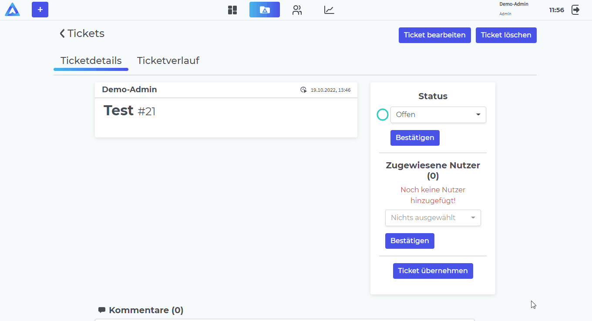

## Projekte

### Erstellen
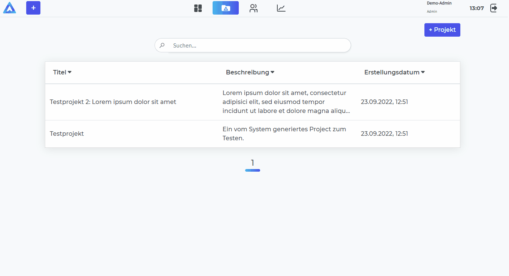
### Bearbeiten
Die Validierung verhindert, dass ein Projekt keinen Titel hat und das ein Titel doppelt vorkommt.
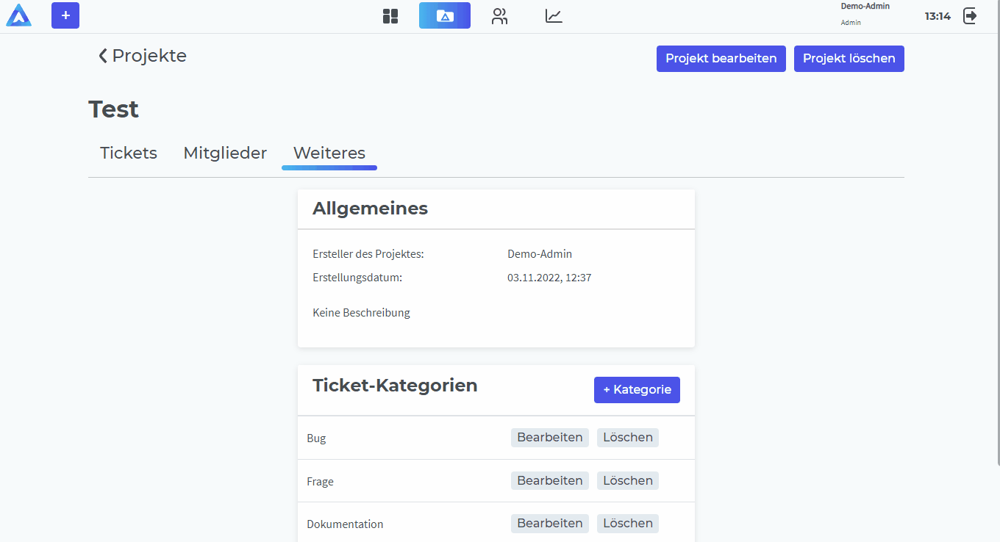
### Löschen

### Mitglieder
Nutzer können Mitglieder eines Projektes sein. Mitglieder haben eine Projektrolle.
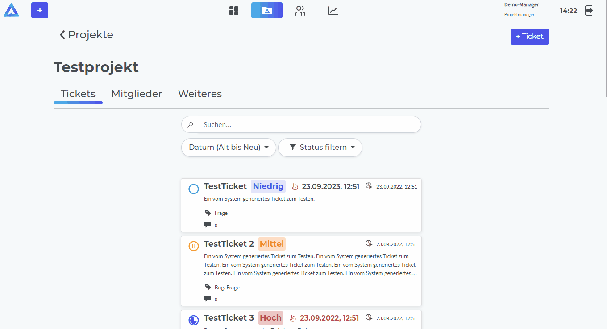
### Kategorien
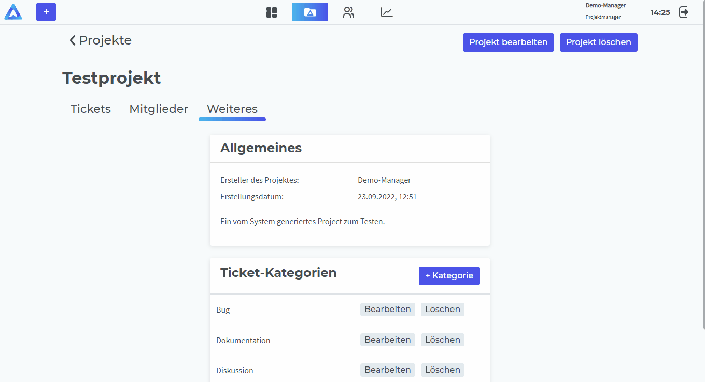

## Tickets
 
Ein Ticket enthält folgendes:
* Titel
* Beschreibung
* Status (*Offen*, *In Bearbeitung*, *Pausiert*, *Abgebrochen*, *Abgeschlossen*)
* Bild/er
* Deadline (wird bei Ablauf rot und mit Nachricht angezeigt)
* Priorität (*Niedrig*, *Mittel* oder *Hoch*)
* dem Ticket zugewiesene Kategorie/n
* dem Ticket zugewiesene Mitglieder
* Kommentare
* Ticketverlauf

### Erstellen
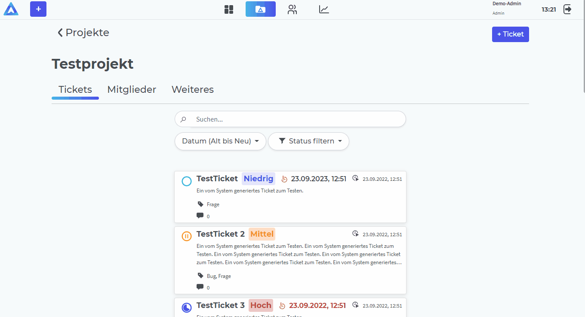
### Kommentieren, Status ändern, Mitglieder zuweisen

### Bearbeiten

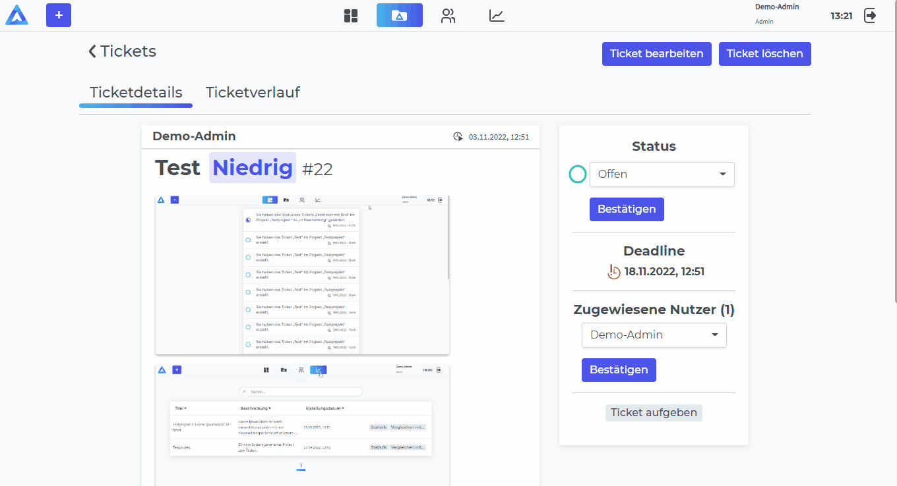
### Löschen
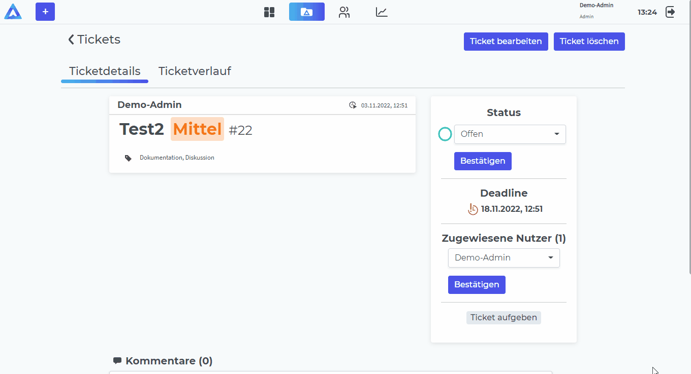

### Verlauf
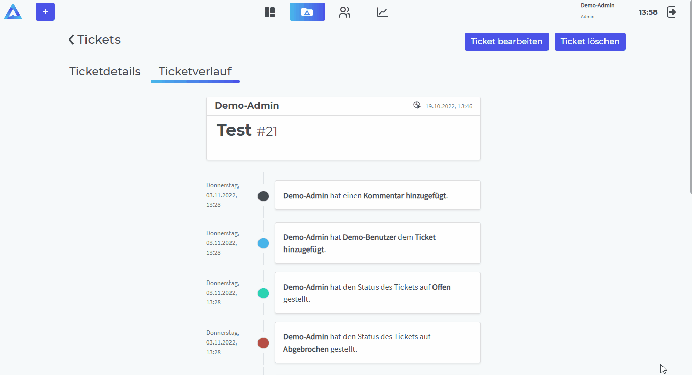
## Nutzer
 
Nur ein Admin kann Nutzer erstellen, löschen und bearbeiten.

Der einzigartige Nutzername wird aus der Kombination aus Vorname, Nachname und einer vierstelligen Zahl gebildet

### Erstellen
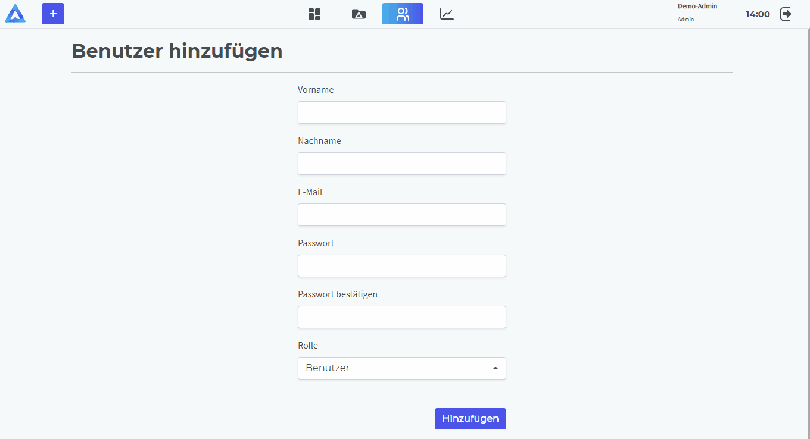
### Bearbeiten
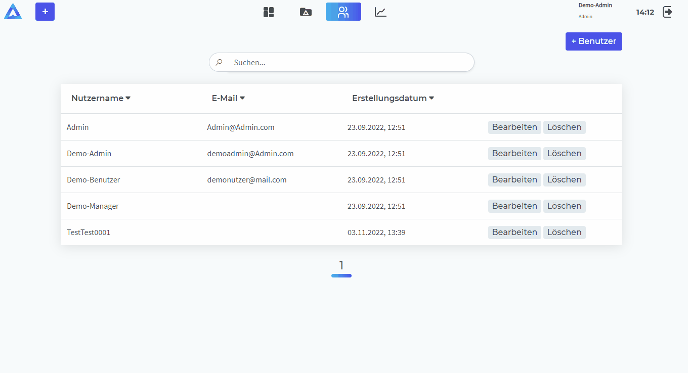
### Löschen
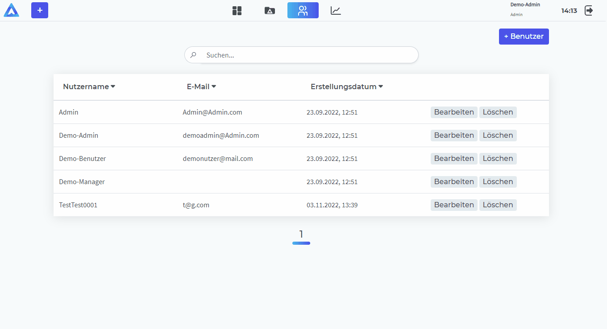
## Statistik
 
### Statistik eines Projektes
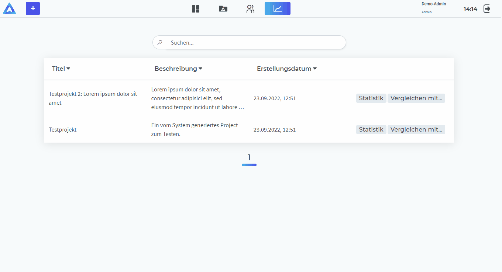
### Vergleich zweier Projekte

## Navigation

Die Anwendung ist in vier Reiter aufgeteilt: Dashboard, Projekte, Benutzer und Statistiken.
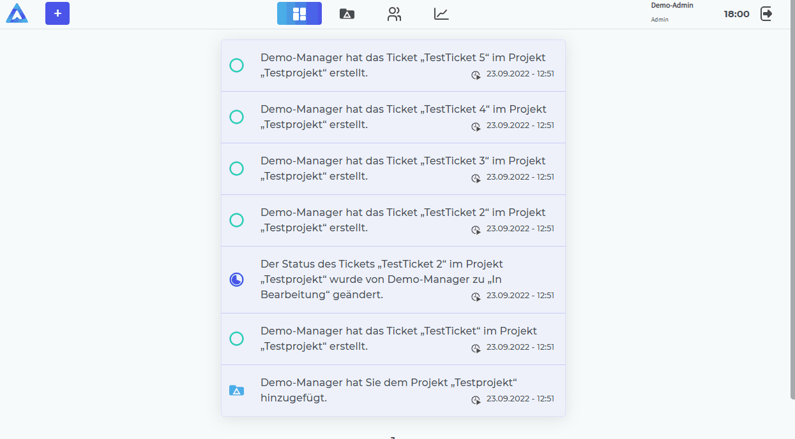

## Suchen

**Tickets, Projekte, Nutzer und Mitglieder** können gesucht werden.
 
Dabei werden die Attribute, nach denen gesucht werden kann, in einem Tooltip über der Suche angezeigt.

## Sortieren und Filtern

**Nutzer, Projekte, Mitglieder** können in einer Tabelle sortiert werden.
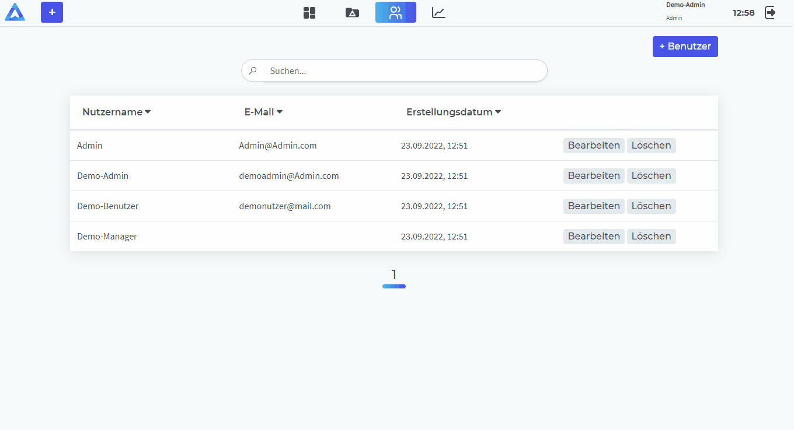

**Tickets** können wegen ihrer zentralen Rolle nach mehreren verschiedenen Eigenschaften sortiert werden.
  
Der **Status** eines Tickets kann gefiltert werden.
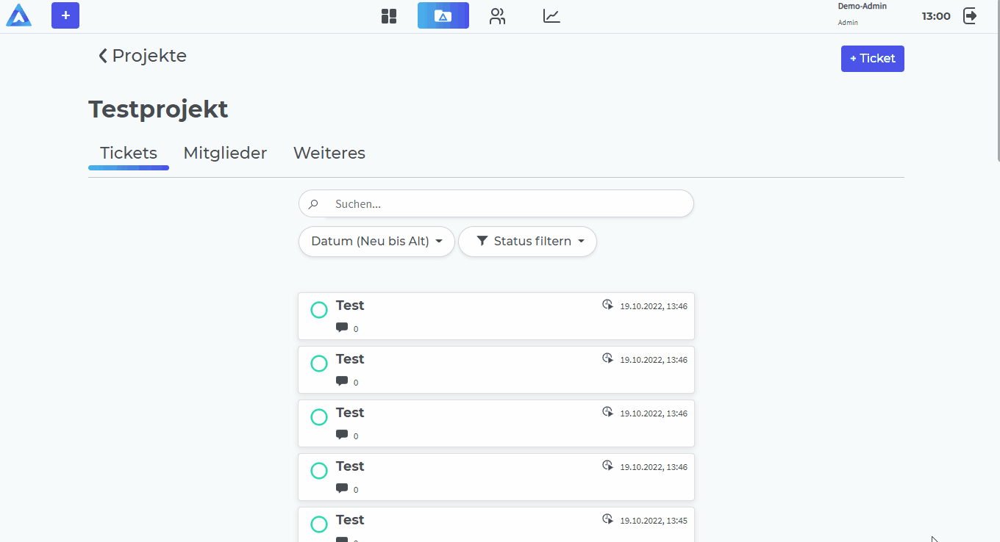

## Seitenadressierung

Das **Dashboard, Projekte, Tickets, Ticketverläufe, Kommentare, Mitglieder und Nutzer** haben Seitenadressierungen.
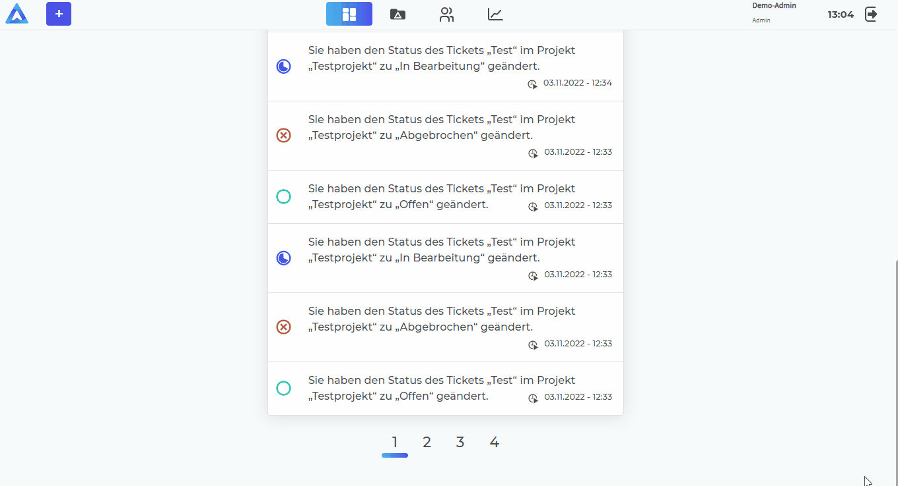

# Rollen und deren Befugnisse
Es gibt zwei Arten von Rollen, die ein Nutzer haben kann: 
 

* **Projektrollen** für jedes Projekt in dem ein Nutzer Mitglied ist
 
* Eine einzige **Nutzerrolle**

 

Die **zwei Projektrollen** sind: *Eigentümer* und *Teilnehmer*

Die **drei Nutzerrollen** sind: *Admin*, *Projektmanager* und *Benutzer*

 

## Nutzerrollen

Nutzerrollen entscheiden über generelle Befugnisse: 

### Benutzer
* kann Nutzer nur einsehen
* kann nur Projekte einsehen, in denen der Benutzer Mitglied ist

### Admin
* kann auf alles zugreifen und alle Aktionen tätigen und auch die Sonderaktionen von Eigentümern ohne einer zu sein nutzen.
* kann Nutzer erstellen, bearbeiten und löschen
* kann alle Projekte einsehen, bearbeiten und löschen

### Projektmanager
* kann Projekte erstellen
* kann Nutzer nur einsehen
* kann nur Projekte einsehen, in denen der Projektmanager Mitglied ist

## Projektrollen

Projektrollen entscheiden über Befugnisse bezüglich eines Projektes und dessen Tickets.
Nach Erstellen eines Projektes wird dieser Nutzer zum Eigentümer dessen.

 

### Beide Projektrollen können:

* alle Tickets im Projekt einsehen
* von allen Tickets den Status ändern
* sich allen Tickets selbst zuweisen
* Tickets erstellen
* selbst erstellte Tickets bearbeiten und löschen
* selbst erstellten Tickets Mitglieder zuweisen
* Kommentare zu jedem Ticket schreiben
* eigene Kommentare löschen
* Kommentare unter selbst erstellten Tickets löschen

### Teilnehmer
* kann Projekt *nicht* bearbeiten oder löschen
* kann Kategorie *nicht* erstellen, bearbeiten oder löschen
* kann Mitglieder *nicht* hinzufügen, bearbeiten oder entfernen
* kann Mitglieder *nicht* zuweisen bei Tickets, die von anderen Nutzern erstellt worden

### Eigentümer
* kann alle Tickets bearbeiten oder löschen
* kann Projekt bearbeiten
* kann Projekt nur löschen, wenn die Nutzerrolle zudem *Projektmanager* oder *Admin* ist
* kann Mitglieder einem Ticket zuweisen
* kann Mitglieder zum Projekt hinzufügen
* kann Rollen von Mitgliedern bearbeiten und Mitglieder aus dem Projekt entfernen
    * Ein *Eigentümer* mit der Nutzerrolle *Benutzer* darf nicht einen *Eigentümer* mit einer höheren Nutzerrolle entfernen oder bearbeiten (*Projektmanager* oder *Admin*)
* kann Kategorien erstellen, bearbeiten und löschen
* kann alle Kommentare löschen
